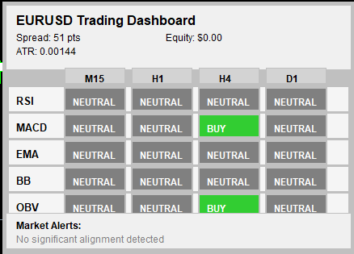
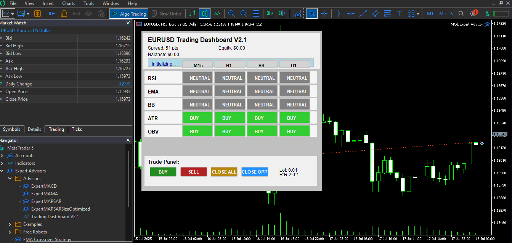

## MT5 Trading Dashboard

This repository contains a custom trading dashboard indicator for MetaTrader 5 (MT5). It is designed to bring together key technical analysis tools into a single, clean, and configurable interface.

## Features in v1.1

Multi-timeframe signal analysis

Integrated signals from 5 indicators: RSI, MACD, EMA, Bollinger Bands, OBV

Account information and market sentiment display

Real-time signal strength tracking

Customizable alerts (sound and popup)

Dynamic layout with chart resize support

Optimized code with error handling

## Version 2.1 Features (New)

Order execution buttons (Buy/Sell) for quick trade placement

Risk management panel with lot size, risk-reward ratio, and stop-loss settings

Enhanced market sentiment tools with percentage-based signal alignment display

Strategy backtest integration for testing indicator signals on historical data

User interface refinements, including customizable colors, fonts, and panel sizing

## Roadmap

The project will be developed in phases, each version adding more features and refinements.

v1.0 – Initial release

v2.1 – Current version with order execution, risk management, enhanced sentiment tools, backtesting and UI improvements

v3.0+ – Planned improvements include:

Advanced position sizing calculator based on account equity

Multi-symbol scanning for cross-market opportunities

Automated trading execution based on signal confirmation

Integration with external data feeds (e.g., economic calendar)

Mobile push notification support for alerts
## Installation

Download the .mq5 file from src/v1.0/TradingDashboard.mq5.

Copy the file into the MQL5/Indicators folder of your MetaTrader 5 installation.

Restart MT5 or refresh the Navigator panel.

Attach the indicator to any chart.

## Usage

Use the dashboard to view real-time signals across multiple timeframes.

Adjust parameters in the input settings to match your trading style.

Alerts can be enabled or disabled from the indicator settings.

## Screenshots

 

  

  

License

This project is licensed under the MIT License.
